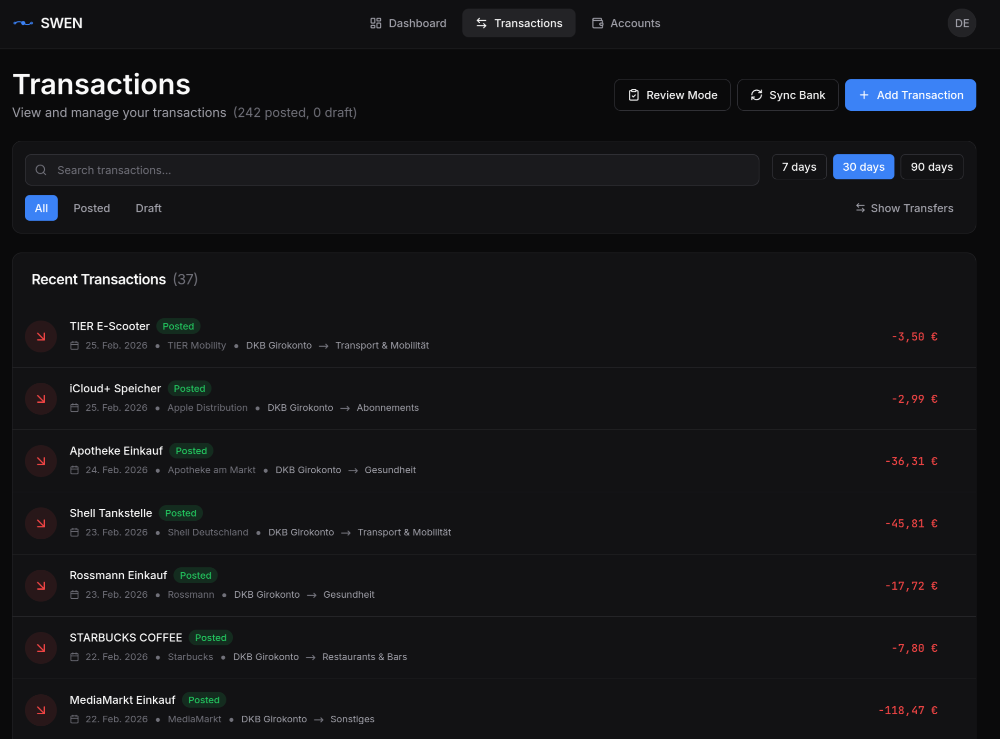

# SWEN — Secure Wallet & Expense Navigator

[](https://github.com/maltewinckler/swen/actions/workflows/ci.yml)
[](https://opensource.org/licenses/MIT)
[](https://hub.docker.com/r/maltewin/swen-backend)

**Self-hosted personal accounting with German FinTS bank sync and ML classification.**

Your bank data is yours. SWEN runs entirely on your own hardware — no cloud, no subscriptions, no middleman between you and your bank. Your credentials and transaction history are stored only on your machine; the only external connection is the direct FinTS link from your server to your bank. One `docker compose up` and you have a full double-entry bookkeeping system that automatically syncs and categorises your bank transactions.


> 📖 **[Full documentation → maltewinckler.github.io/swen](https://maltewinckler.github.io/swen)**

## What SWEN Does

<p align="center">
  
</p>
<p align="center"><em>Dashboard — spending breakdown, income trends, and live account balances</em></p>

| | |
|---|---|
| 🏦 **FinTS / HBCI bank sync** | Direct connection to your German bank via the standardised FinTS protocol. Transactions import automatically with robust duplicate detection. |
| 📒 **Double-entry bookkeeping** | Every transaction is a proper journal entry. Full audit trail, no "lost" money. Define your own chart of accounts or start from a template. |
| 🤖 **ML classification** | A multi-stage ML pipeline (embedding similarity → keyword enrichment → web search) automatically suggests counter-accounts. Gets smarter with every correction you make. |
| 🔒 **Privacy-first** | All data stays on your machine. Credentials are encrypted at rest (Fernet/AES). No telemetry, no analytics, fully open source. |
| 🚀 **One-command deploy** | Ships as a single `docker compose up`. Backend, frontend, ML service, and database — everything included. |

<details>
<summary>More screenshots</summary>

<p align="center">
  
</p>
<p align="center"><em>Transaction list with AI-suggested counter-accounts and confidence indicators</em></p>

<p align="center">
  
</p>
<p align="center"><em>Analytics — spending by category, over time</em></p>

<p align="center">
  
</p>
<p align="center"><em>Responsive mobile layout</em></p>

</details>


## Quick Start

```bash
# 1. Clone
git clone https://github.com/maltewinckler/swen.git
cd swen

# 2. Run the interactive setup wizard — generates secrets and writes config/.env
docker run --rm -it \
  -v ./config:/app/config \
  maltewin/swen-backend:latest \
  swen setup

# 3. Deploy
docker compose up -d
```

Open `http://localhost:3000`. The first user to register automatically becomes an admin. After logging in, configure your FinTS Product ID and institute CSV under **Settings → Administration → FinTS Configuration**.

## Requirements

- **Docker** with Compose V2 (or Podman)
- **RAM**: 4 GB+ recommended (ML model loading)
- A **FinTS Product ID** from [Deutsche Kreditwirtschaft](https://www.fints.org/de/hersteller/produktregistrierung) for bank sync (free registration, a few days turnaround)

## Notes

- **Bank support**: FinTS is supported by most German banks. Check [subsembly.com](https://subsembly.com/banken.html) for a (possibly outdated) list. Currently only the **decoupled push-TAN** method is tested (SecureGo, ING App, DKB App, Sparkasse App).
- **FinTS library**: The backend uses [geldstrom](https://github.com/maltewinckler/geldstrom), a purpose-built FinTS client derived from [python-fints](https://github.com/raphaelm/python-fints).
- **Frontend**: Largely AI-generated (React + TypeScript). It works well in practice but hasn't had a full human review yet — contributions welcome.
- **Version**: SWEN is at v0.1 — functional and used daily, but some features (additional TAN methods, Alembic migrations) are still on the roadmap.
