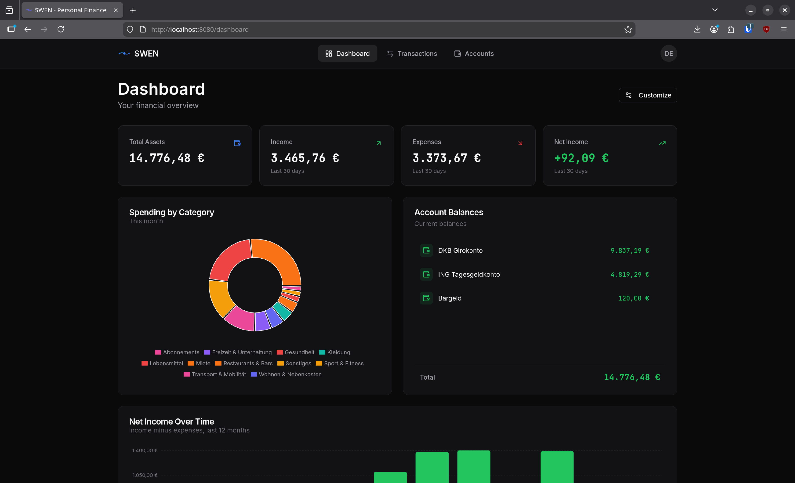
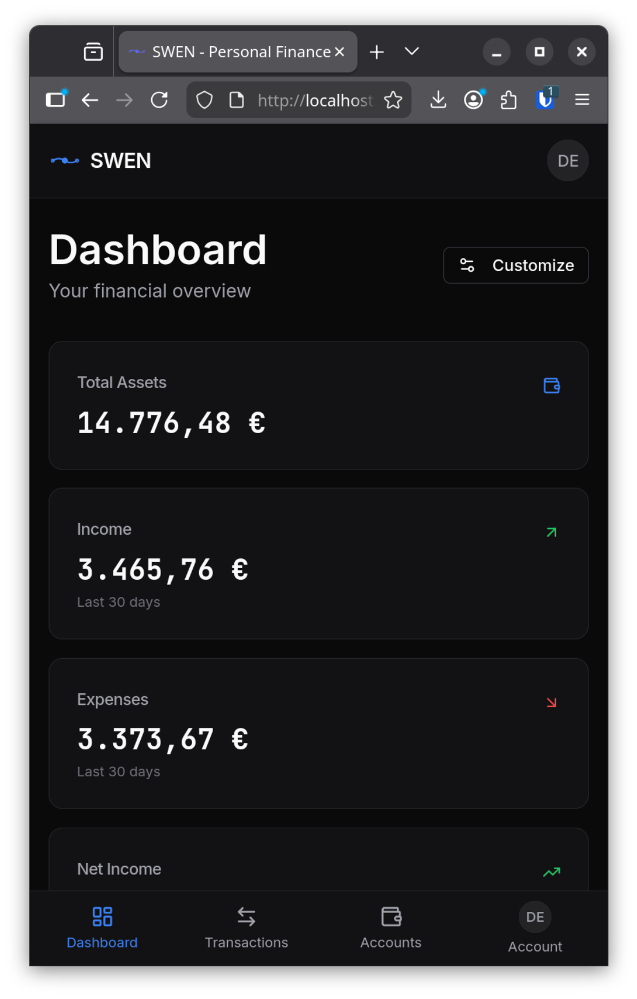

# SWEN - Secure Wallet & Expense Navigator

[](https://github.com/maltewinckler/swen/actions/workflows/ci.yml)
[](https://opensource.org/licenses/MIT)

SWEN is a personal banking application to view, categorize, and analyze your bank transactions. It comes with built in support for German FinTS/HBCI bank to automatically sync your bank transactions.

While searching for a personal bookkeeping app where we do not have to give our very personal data (e.g. banking transactions and even permanent 2FA access to the account), we quickly found that there are not many single-service alternatives available (and it seemed like a good opportunity to learn some domain driven design :-)).

SWEN allows you to:
* Track and organize your transactions in a double-entry bookkeeping system;
* Define categories (in the double entry bookkeeping language `accounts`) yourself or from a template;
* Connect to your FINTS/HBCI enabled bank (find a maybe outdated list [under subsembly.com](https://subsembly.com/banken.html))and automatically import your transactions with a solid duplicate detection.
* Assign your income, expenses, and internal transfers automatically to the respective income/expense/asset accounts. We follow a stepwise approach which is based on `sentence-transformers` and keyword enhancements. More details can be found below.

> **Version Note**: I consider SWEN to be in version 0.1. There are still important parts missing which I decided to cut short for MVP. This includes among others other TAN methods than the decoupled app 2FA (e.g. SecureGo App, ING App, DKB App, ...). Moreover, the TAN process has not been tested for *all* banks. Hence, if you find an issue, please create an issue :-).

> **Important Note**: In order to use the bank connection functionality, you need to register your deployment at the Deutsche Kreditwirtschaft and get a product id. This is a mandatory step for a few years now. It usually works quite quickly. Register your deployment [here](https://www.fints.org/de/hersteller/produktregistrierung). After registering, you will receive a Product ID and a `.csv` file with all the bank-related information. Both are configured through the admin UI under **Settings → Administration → FinTS Configuration**.

> **AI Disclaimer**: The frontend is almost completely AI generated. I just have no clue about React and Type Script. Therefore, be cautious until it is thoroughly reviewed. Moreover, some parts of the backend were created with AI-assistance. Usually, when there are large Docstrings, the parts are generated by AI. Some other Documentation, Docstrings in python classes were also created with AI assistance.

> **Dependencies Note**: The backend depends on a python package [geldstrom](https://github.com/maltewinckler/geldstrom) which is *greatly* inspired by the OG FinTS implementation [python-fints](https://github.com/raphaelm/python-fints) with a reduced functionality set for SWEN. This is still under development.

## Screenshots

<p align="center">
  
</p>

<p align="center">
  <em>Dashboard with expense breakdown, income trends, and account balances</em>
</p>

<details>
<summary>Mobile View</summary>

<p align="center">
  
</p>

</details>

## Getting Started (Local Development)

Below you can find two different deployment guides: One for the production usage with Docker and one for barebone install, best suited for development and testing purposes.

Both ways require roughly:
- **RAM**: 4+ GB recommended for ML classification features
- **Disk**: ~500 MB for dependencies, plus space for your database and ML models (~500 MB)

Both installation methods use `.env` files in the `config/` directory:

| File | Used by | `POSTGRES_HOST` |
|---|---|---|
| `config/.env.dev` | Bare metal (Makefile) | `localhost` |
| `config/.env` | Docker Compose | `postgres` |


## Docker Compose

We will describe the steps for a docker deployment with a reverse proxy. You can choose to use our built in Caddy service, but we recommend to built it into your own production reverse proxy. To make it easier, we have put some example files to `services/proxy/examples/`. **Note**: These are AI generated and we have not (yet) tested if they work, so please be cautious.

### Prerequisites

- Docker with Compose V2 (or Podman — alias `docker` to `podman`)
- A reverse proxy (nginx, Caddy, Traefik, etc.) or use our built in one for quick testing
- A FinTS Product ID and institute directory CSV from Deutsche Kreditwirtschaft for bank sync ([register here](https://www.fints.org/de/hersteller/produktregistrierung)). These are configured via the admin UI after first login.

### Generate Secrets

```bash
docker compose build backend
docker compose run --rm --no-deps backend swen secrets generate
```

### Edit Configuration

Copy and edit the environment file:

```bash
cp config/.env.example config/.env
```

Edit `config/.env` with your values:

```bash
# Required secrets (from secrets generate command)
ENCRYPTION_KEY=<generated-key>
JWT_SECRET_KEY=<generated-key>
POSTGRES_PASSWORD=<generated-key>

# Docker networking (use service names, not localhost!)
POSTGRES_HOST=postgres

# Your domain and security settings
API_COOKIE_SECURE=true
API_CORS_ORIGINS=https://swen.example.com

# Frontend URL (required for password reset emails)
FRONTEND_BASE_URL=https://swen.example.com

# Frontend: Allow access from your domain (required for Vite preview server)
VITE_ALLOWED_HOSTS=swen.example.com

# User registration: "open" (anyone can register) or "admin_only" (default)
REGISTRATION_MODE=admin_only

# SMTP settings (required for password reset emails)
SMTP_ENABLED=true
SMTP_HOST=smtp.example.com
SMTP_PORT=587
SMTP_USER=your-smtp-user
SMTP_PASSWORD=your-smtp-password
SMTP_FROM_EMAIL=noreply@example.com
SMTP_FROM_NAME=SWEN
```

> **Note:** The first user to register automatically becomes an admin. Admins can create additional users via the `/api/v1/admin/users` endpoint when `REGISTRATION_MODE=admin_only`.

### Configure Your Reverse Proxy

Route these paths to the Docker containers:

- `/api/*`: `http://swen-backend:8000`
- `/health`: `http://swen-backend:8000`
- `/*`: `http://swen-frontend:3000`

If your proxy runs on the host (not in Docker), use `localhost` instead of container names.

### Deploy

```bash
# If you have configured your own proxy, run
docker compose up -d
# If not run and you want to use our built in proxy
docker compose --profile proxy up -d
```

> **Note:** The ML models are automatically downloaded on first startup of the ML service.

> **Note**: The proxy built into SWEN is mostly for testing purposes and a quick setup in a fresh homelab VM. We recommend to use your own reverse proxy in production. Moreover, We use port 8080/8443 by default for rootless container compatibility. If you need ports 80/443, run the proxy deployment as root.

## Bare Metal

This guide covers running SWEN without Docker, directly on your machine. This is not made to run in a prod environment! Just for a quick demo, development, ...

### Prerequisites

* `Python >= 3.10` (backend and ML service)
* `uv >= 0.5` (Python package manager)
* `Node.js >= 24` (frontend)
* `PostgreSQL >= 18` (database)

### Installation

1. **Clone the repository**

   ```bash
   git clone https://github.com/maltewinckler/swen.git
   cd swen
   ```

2. **Install all dependencies**

   ```bash
   make install
   ```

   This installs both Python (via uv) and Node.js (via npm) dependencies.

3. **Create your configuration**

   ```bash
   cp config/.env.example config/.env.dev
   ```

   Then edit `config/.env.dev`:

   ```bash
   # For local development, you can enable open registration
   REGISTRATION_MODE=open

   # Optional: SMTP for password reset (defaults to disabled)
   # SMTP_ENABLED=false
   ```

   The other defaults (encryption key, JWT secret) work fine for **local** development but are **not** safe for prod use.

   > **Note:** The first user to register automatically becomes an admin. After registering, configure your FinTS Product ID and institute directory in **Settings → Administration → FinTS Configuration**.

### Running the Application

SWEN consists of four services. Run each in a separate terminal:

   * `make backend`: Starts the backend API on http://127.0.0.1:8000
   * `make frontend`: Starts the React dev server on http://localhost:3000
   * `make ml`: Starts the ML service for transaction classification (optional, for AI features)
   * Database (Postgres) must be running (via system service or Docker)

Then open http://localhost:3000 in your browser.

### Makefile Reference

Run `make help` for a full list of commands. Here are the most common:

- `make install`: Install all dependencies
- `make backend`: Start the backend API server
- `make frontend`: Start the frontend dev server
- `make ml`: Start the ML service for AI classification
- `make test`: Run all tests
- `make lint`: Run linters (backend + frontend)
- `make build`: Build frontend for production
- `make clean`: Remove build artifacts
- `make db-init`: Initialize database tables
- `make db-reset`: Reset the database (WARNING: deletes all data)
