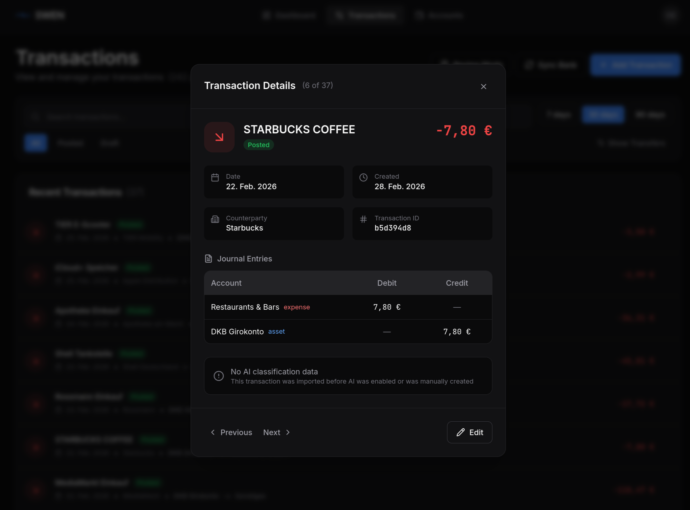
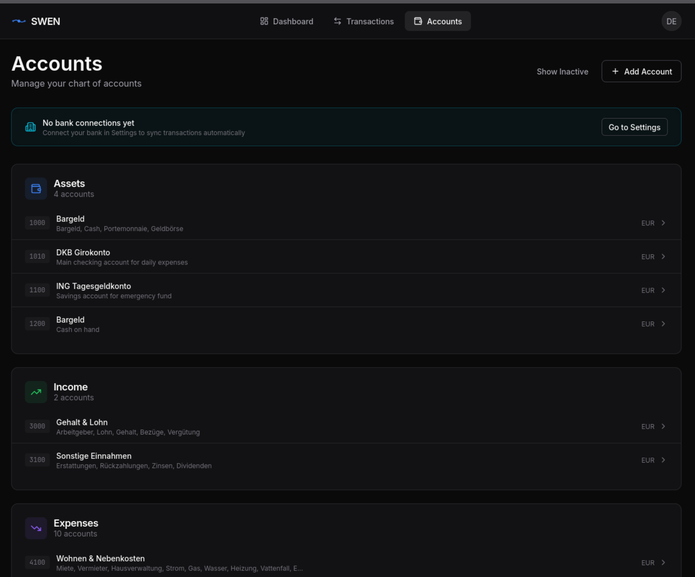

# Double-Entry Bookkeeping

SWEN records every transaction using **double-entry bookkeeping** — the same system banks, businesses, and accountants have used for 500 years. You do not need an accounting degree to use it, but knowing the basics makes SWEN's UI click into place.

## The Core Rule

Every financial event has **two equal and opposite sides**:

$$
\sum \text{Debits} = \sum \text{Credits}
$$

Money does not appear or disappear — it moves *from* one account *to* another. This makes errors self-revealing: if the books don't balance, something is wrong.

## Account Types

SWEN uses the standard five account types:

| Type | Tracks | Increases with | Decreases with | Example |
|---|---|---|---|---|
| **Asset** | What you own | Debit | Credit | Checking account, savings |
| **Liability** | What you owe | Credit | Debit | Credit card balance |
| **Equity** | Net worth | Credit | Debit | Opening balance account |
| **Income** | Money earned | Credit | Debit | Salary, interest |
| **Expense** | Money spent | Debit | Credit | Groceries, rent |

!!! tip "A useful shorthand"
    For personal finance: Assets and Expenses go up on the **left** (debit); Liabilities, Equity, and Income go up on the **right** (credit).

## A Worked Example

You pay €85.00 at the supermarket. Your bank account (Asset) decreases; your Groceries expense account increases.

| Account | Debit | Credit |
|---|---|---|
| Groceries (Expense) | €85.00 | |
| Checking Account (Asset) | | €85.00 |
| **Total** | **€85.00** | **€85.00** |

In SWEN this looks like:

<!-- SCREENSHOT: transaction-detail.png — Transaction detail modal showing journal entries (debit + credit lines) -->


## SWEN's Account Hierarchy

```
Assets
├── Checking Account (DE12 3456 …)    ← linked to your BankAccount
├── Savings Account
└── Cash

Liabilities
└── Credit Card

Equity
└── Opening Balances

Income
├── Salary
└── Interest

Expenses
├── Groceries
├── Transport
├── Rent
└── …
```

<!-- SCREENSHOT: accounts-chart-of-accounts.png — Chart of accounts tree (Asset / Liability / Equity / Income / Expense) -->


## BankAccount vs Account

These two terms are often confused:

| Term | What it is | Example |
|---|---|---|
| `BankAccount` | Your actual bank account with an IBAN | `DE12 3456 7890 0000 1234 56` |
| `Account` | A bookkeeping ledger account | `Groceries (Expense)` |

A `BankAccount` is **always linked to an `Account`** of type Asset. When you import a bank statement, raw `BankTransaction` records are created. SWEN then creates a double-entry `Transaction` (journal entry) that posts the movement between the Asset account (your bank) and the appropriate counter-account (e.g. Groceries).

## Draft vs Posted Transactions

| State | Meaning |
|---|---|
| **Draft** | AI has suggested a counter-account; awaiting your review |
| **Posted** | You have confirmed the entry; included in all reports |

Only **Posted** transactions affect your account balances. Drafts are work in progress.

## What "Posting" Means

When you click **Post** on a Draft transaction, SWEN:

1. Validates that debits equal credits
2. Records the journal entry permanently
3. Updates the running balance of all affected accounts
4. Marks the linked `BankTransaction` as reconciled

Posted transactions cannot be edited — they can only be reversed with a correcting entry (coming in a future version).
