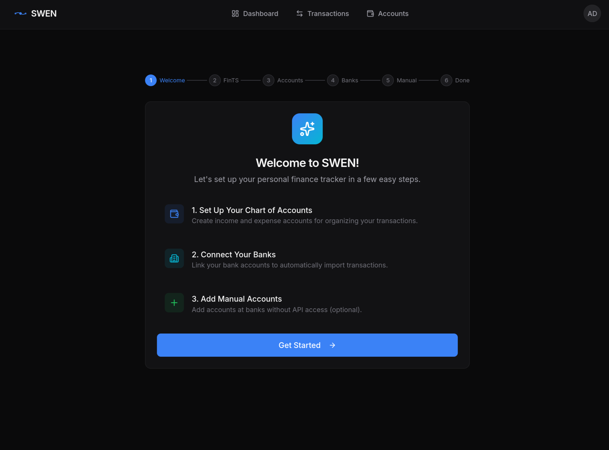
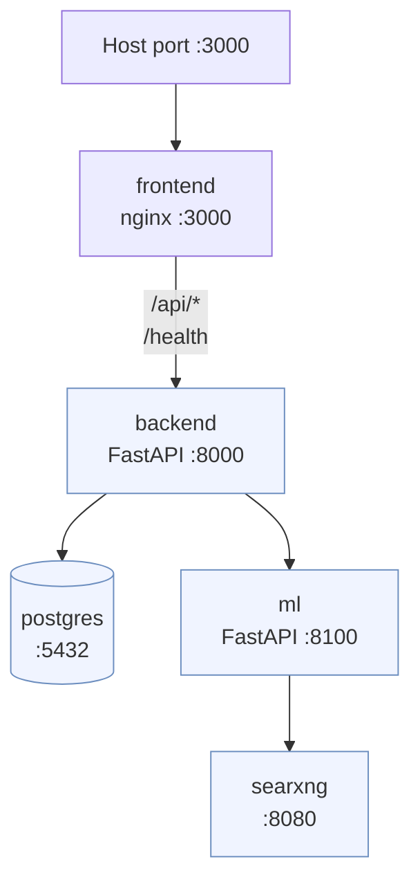

# Docker Deployment

The recommended way to run SWEN in production or on a homelab.

## Prerequisites

- Docker Engine 24+ with Compose V2 (`docker compose version`)
- A reverse proxy in front of SWEN (nginx, Caddy, Traefik — or use SWEN's bundled proxy for quick tests)

## 1 · Clone the Repository

```bash
git clone https://github.com/maltewinckler/swen.git
cd swen
```

## 2 · Build the Images

```bash
docker compose build
```

## 3 · Create `config/.env`

Run the interactive setup wizard using a disposable backend container. It mounts the host `config/` folder so the generated file lands directly on your machine:

```bash
docker run --rm -it \
  -v ./config:/app/config \
  maltewin/swen-backend:latest \
  swen setup
```

The wizard will ask you to choose the environment (select **Production**), set the registration mode, optionally configure SMTP, then generate all secrets and write `config/.env` automatically.

!!! tip "No Docker Hub access yet?"
    If you built the images locally in the previous step, replace `maltewin/swen-backend:latest` with `swen-backend` (the local image name assigned by Compose).

## 4 · Deploy

```bash
docker compose up -d
```

Open `http://localhost:3000` (or your reverse proxy URL).

<!-- SCREENSHOT: onboarding.png — First-run onboarding wizard (step 1 or account mapping step) -->


!!! tip "First user = admin"
    The first account registered automatically receives admin privileges. After signing up, go to **Settings → Administration → FinTS Configuration** to add your Product ID and institute CSV.

## Service Topology



Only port **3000** is exposed to the host. All other services communicate over the internal `swen_network` Docker network.

## Volume Overview

| Volume | Contents | Notes |
|---|---|---|
| `postgres-data` | All your financial data | Back this up! |
| `ml-model-cache` | Downloaded HuggingFace model (~1.5 GB) | Survives container updates |
| `./config` | `config/.env` and `fints_institute.csv` | Read-only inside containers |

## Reverse Proxy Setup

Route traffic to the `frontend` container (port 3000). The frontend's nginx proxy handles forwarding `/api/*` and `/health` to the backend internally — **you only need to point your proxy at port 3000**.

=== "nginx"

    ```nginx
    server {
        listen 443 ssl;
        server_name swen.example.com;

        location / {
            proxy_pass         http://localhost:3000;
            proxy_set_header   Host $host;
            proxy_set_header   X-Real-IP $remote_addr;
            proxy_set_header   X-Forwarded-For $proxy_add_x_forwarded_for;
            proxy_set_header   X-Forwarded-Proto $scheme;
        }
    }
    ```

=== "Caddy"

    ```
    swen.example.com {
        reverse_proxy localhost:3000
    }
    ```

=== "Traefik (label)"

    ```yaml
    labels:
      - "traefik.enable=true"
      - "traefik.http.routers.swen.rule=Host(`swen.example.com`)"
      - "traefik.http.services.swen.loadbalancer.server.port=3000"
    ```

!!! note "Host vs container networking"
    If your proxy runs **inside Docker** on the same host, use the container name `frontend` instead of `localhost`.

## Importing Bank Transactions

<!-- SCREENSHOT: import-flow.png — Bank sync modal / import progress screen -->


Once FinTS is configured:

1. Go to **Bank Accounts** → select an account → **Sync**
2. SWEN fetches the last 90 days (configurable) from your bank
3. New transactions appear as **Draft** — review and post them

!!! note "First ML model download"
    On first startup the ML service downloads `deutsche-telekom/gbert-large-paraphrase-cosine` (~1.5 GB) from HuggingFace. Classification is unavailable until the download completes. Watch the ML container log: `docker compose logs -f ml`.

## Updating SWEN

```bash
docker compose pull
docker compose up -d
```

The `postgres-data` and `ml-model-cache` volumes are preserved across updates.

## Troubleshooting

| Symptom | Likely cause | Fix |
|---|---|---|
| ML service never ready | Model still downloading | `docker compose logs -f ml` |
| 500 from `/api/v1/...` | DB not initialised | `docker compose run --rm backend db-init` |
| CORS errors in browser | `API_CORS_ORIGINS` wrong | Set to your exact frontend origin |
| Emails not sent | SMTP misconfigured | Check `SMTP_*` vars, `SMTP_ENABLED=true` |
