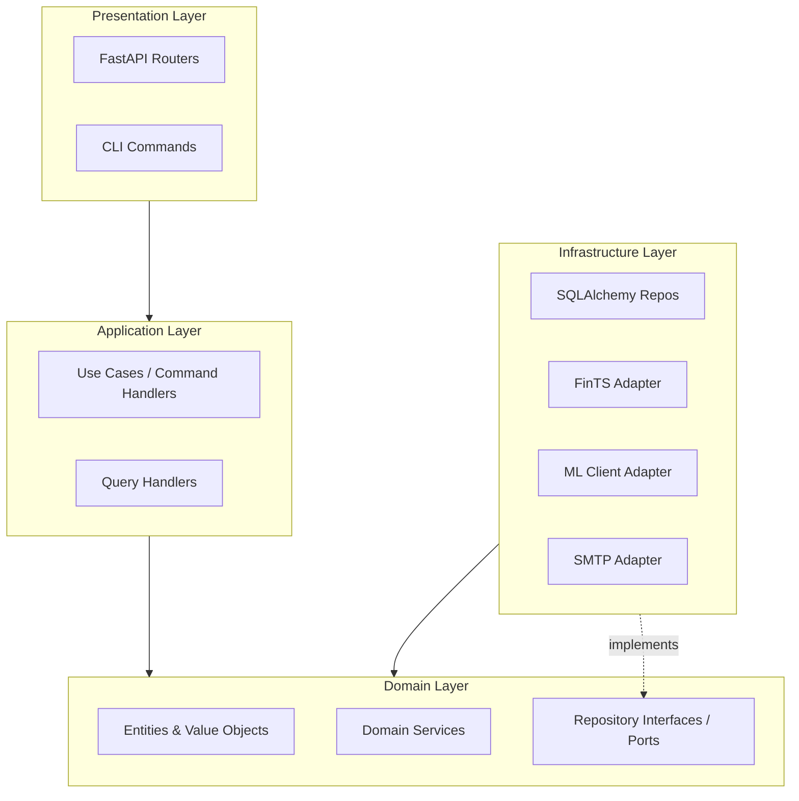
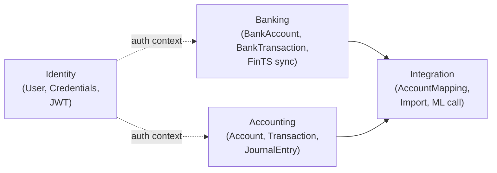
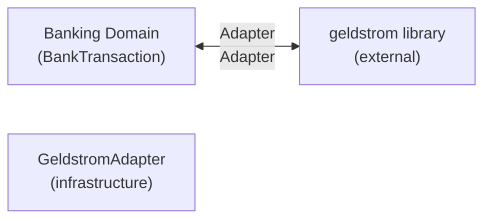

# Architecture

SWEN is built on three principles: **Domain-Driven Design (DDD)**, **Hexagonal Architecture** (Ports & Adapters), and **CQRS**. Each principle has a specific reason for being here.

## Why DDD?

Personal finance has a rich, precise domain with its own language (see [Domain Model](../concepts/domain-model.md)). DDD enforces that **the domain owns the business rules** — the `Account`, `Transaction`, and `JournalEntry` classes contain invariants (e.g. "a Transaction must balance"), not the HTTP controllers or the database layer.

This means:

- Business rules are testable in pure Python without any framework or DB
- The domain model is readable by a domain expert, not just a developer
- Infrastructure details (Postgres, FinTS, HTTP) can be swapped without touching domain logic

## Hexagonal Architecture (Ports & Adapters)



**The dependency rule:** inner layers never import outer layers.

| Layer | Contains | May import |
|---|---|---|
| Domain | Entities, value objects, domain services, port interfaces | Nothing outside domain |
| Application | Use cases, command/query handlers | Domain |
| Infrastructure | DB repos, external clients, adapters | Domain + Application |
| Presentation | FastAPI routers, CLI entrypoints | Application + Domain |

## CQRS — Commands vs Queries

SWEN separates **write** operations (Commands) from **read** operations (Queries).

| Aspect | Command | Query |
|---|---|---|
| Purpose | Change state | Read state |
| Returns | Nothing (or ID) | DTO / read model |
| Side effects | Yes | None |
| Example | `PostTransactionCommand` | `GetTransactionQuery` |

Commands go through the Application layer use cases and touch the domain model. Queries can shortcut directly to the database via read-optimised DTOs, bypassing the domain entirely.

## Bounded Contexts

SWEN has four bounded contexts, each with its own Python package:



| Context | Package | Responsibility |
|---|---|---|
| Accounting | `swen` | Double-entry bookkeeping, accounts, transactions |
| Banking | `swen` | Bank accounts, FinTS fetch, raw transactions |
| Identity | `swen_identity` | Users, password hashing, JWT tokens |
| Integration | `swen` | Account mapping, import orchestration, ML client |

## Repository Pattern + UserContext

Every domain repository takes a **`UserContext`** (the authenticated user's ID + tenant ID). All database queries are automatically scoped to that user — there is no way to accidentally fetch another user's data.

```python
class TransactionRepository(Protocol):
    async def get_by_id(
        self, id: TransactionId, ctx: UserContext
    ) -> Transaction | None: ...
```

This pattern enforces multi-tenancy at the type level.

## Anti-Corruption Layer: GeldstromAdapter

The FinTS library (`geldstrom`) is an external dependency with its own domain model. A `GeldstromAdapter` translates between the external library's types and SWEN's domain types, so the domain never depends directly on the library.



If `geldstrom` is ever replaced, only the adapter needs to change.
