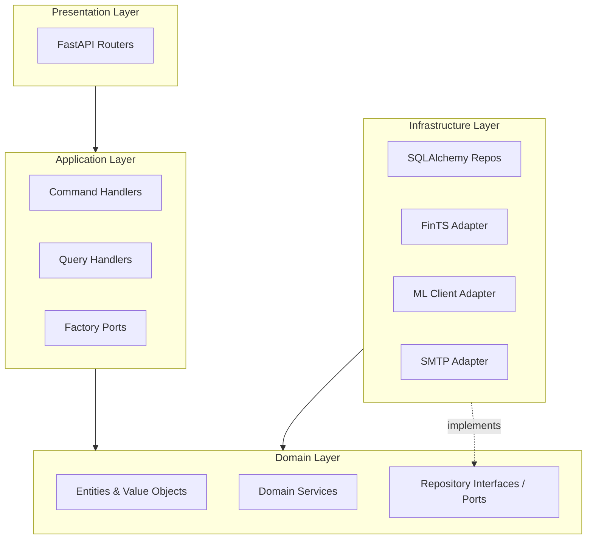
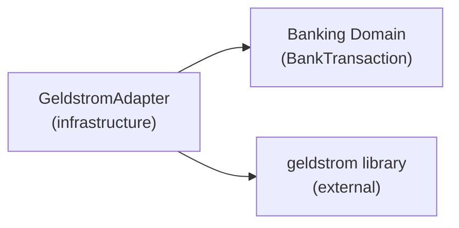

# Architecture

SWEN is built on three principles: **Domain-Driven Design (DDD)**, **Hexagonal Architecture** (Ports & Adapters), and **CQRS**. Each principle has a specific reason for being here.

## Why DDD?

Personal finance has a rich, precise domain with its own language (see [Domain Model](../concepts/domain-model.md)). DDD enforces that **the domain owns the business rules** — the `Account`, `Transaction`, and `JournalEntry` classes contain invariants (e.g. "a Transaction must balance"), not the HTTP controllers or the database layer.

This means:

- Business rules are testable in pure Python without any framework or DB
- The domain model is readable by a domain expert, not just a developer
- Infrastructure details (Postgres, FinTS, HTTP) can be swapped without touching domain logic

## Hexagonal Architecture (Ports & Adapters)


```mermaid
graph TD
    subgraph Domain["Domain Layer"]
        E[Entities & Value Objects]
        S[Domain Services]
        R[Repository Interfaces / Ports]
    end

    subgraph Application["Application Layer"]
        UC[Command Handlers]
        QH[Query Handlers]
        FC[Factory Ports]
    end

    subgraph Infrastructure["Infrastructure Layer"]
        DB[SQLAlchemy Repos]
        FS[FinTS Adapter]
        ML[ML Client Adapter]
        SMTP[SMTP Adapter]
    end

    subgraph Presentation["Presentation Layer"]
        API[FastAPI Routers]
    end

    Presentation --> Application
    Application --> Domain
    Infrastructure --> Domain
    Infrastructure -.->|implements| R
```

**The dependency rule:** inner layers never import outer layers.

| Layer | Contains | May import |
|---|---|---|
| Domain | Entities, value objects, domain services, port interfaces | Nothing outside domain |
| Application | Use cases, command/query handlers | Domain |
| Infrastructure | DB repos, external clients, adapters | Domain + Application |
| Presentation | FastAPI routers, CLI entrypoints | Application + Domain |

## CQRS (Commands and Queries)

SWEN separates **write** operations (Commands) from **read** operations (Queries).

| Aspect | Command | Query |
|---|---|---|
| Purpose | Change state | Read state |
| Returns | Nothing (or ID) | DTO / read model |
| Side effects | Yes | None |
| Example | `CreateAccountCommand` | `ListAccountsQuery` |

Commands and Queries go through the Application layer use cases and touch the domain model. All read/write operations must go through domain repository ports. Actual implementations (SQLAlchemy for Postgres) live in the infrastructure layer.

## Bounded Contexts

SWEN is split into four Python packages, each serving a distinct role:

| Package | Responsibility |
|---|---|
| `swen` | Main bounded context with sub-contexts for accounting, banking, integration, and analytics. Resembles the main swen backend part. |
| `swen_identity` | Identity management: users, password hashing, JWT tokens, password reset |
| `swen_config` | Shared configuration: Pydantic Settings loaded from environment variables and `.env` files. Injected into swen presentation layer. Immutable by users. |
| `swen_demo` | Demo data generation: seed scripts and transaction templates. |

### Sub-Contexts

In the `swen` package, we have multiple sub contexts which are generally bounded. The big swen application layer might combine concerns from these contexts.

| Sub-Context | Responsibility |
|---|---|
| Accounting | Double-entry bookkeeping, accounts, transactions |
| Banking | Bank accounts, FinTS fetch, credentials |
| Integration | Account mapping, import orchestration, ML client |
| Analytics | Read queries for dashboards, reports, exports |


## Key Protocols & Patterns

### Repository + Factory Pattern

Every domain repository is constructed by the **`RepositoryFactory`**, which automatically scopes all queries to `current_user.user_id`. This is the project's main auth boundary. There is (hopefully lmao) no way to accidentally fetch another user's data.

```python
# Repository interfaces take no user context.
class TransactionRepository(Protocol):
    async def get_by_id(self, id: TransactionId) -> Transaction | None: ...

# Every query is automatically scoped to current_user.user_id.
repo = factory.transaction_repository()  # auto-scoped
txn = await repo.get_by_id(txn_id)       # filtered by user_id internally
```

All application commands and queries should have a `.from_factory` method such that we have a unified initialization pattern.

### Unit of Work

All write operations use a Unit of Work pattern via `infrastructure/persistence/sqlalchemy/unit_of_work.py`. The `UnitOfWork` wraps the SQLAlchemy `AsyncSession`, managing transaction boundaries across multiple repositories. Commands use it as an async context manager — `commit()` is called on clean exit, `rollback()` on exception.

```python
async with self._uow:
    await repo.save(entity)
    # commit() happens automatically here
# rollback() happens here if an exception occurred
```

### SyncEventPublisher Port

The `SyncEventPublisher` (defined in `application/ports/integration/sync_event_publisher.py`) is an abstract interface for SSE event delivery. The infrastructure implementation `SseSyncEventPublisher` uses a queue-backed async iterator to stream events to connected clients. This decouples event emission from the sync orchestration — application services publish events without knowing about SSE, HTTP, or the frontend.

```python
class SyncEventPublisher(Protocol):
    async def publish(self, event: SyncProgressEvent) -> None: ...
    async def close(self) -> None: ...
```

### CounterAccountProposalPort

The `CounterAccountProposalPort` (defined in `application/ports/ml_service.py`) is the protocol that the ML service implements for batch counter-account classification. The `MLCounterAccountAdapter` is the concrete implementation that sends batch classification requests to the ML service. This port is separate from `MLServicePort` (which handles training example submission and account embeddings).


## Anti-Corruption Layer: GeldstromAdapter

The FinTS library (`geldstrom`) is an external dependency with its own domain model. A `GeldstromAdapter` translates between the external library's types and SWEN's domain types, so the domain never depends directly on the library.


```mermaid
graph LR
    Domain["Banking Domain\n(BankTransaction)"]
    Adapter["GeldstromAdapter\n(infrastructure)"]
    Lib["geldstrom library\n(external)"]

    Adapter --> Domain
    Adapter --> Lib
```

If `geldstrom` is ever replaced, only the adapter needs to change.
