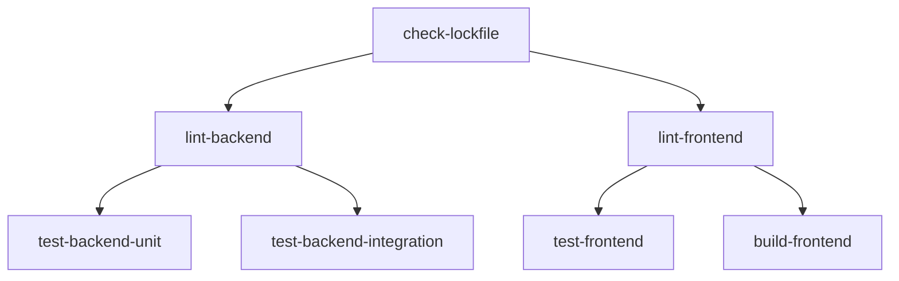

# CI / GitHub Actions

SWEN has two automated workflows: **CI** (on every push/PR) and **Docker Publish** (on every GitHub Release).

## CI Workflow (`ci.yml`)

Triggers on every push and pull request to `main`.



### Jobs

#### `check-lockfile`

```yaml
run: uv lock --check
```

Verifies that `uv.lock` is consistent with all `pyproject.toml` files. Fails fast if someone added a dependency but forgot to commit the updated lockfile.

#### `lint-backend`

Runs **Ruff** in check mode and format check:

```bash
ruff check services/backend/src/
ruff format --check services/backend/src/
```

#### `lint-frontend`

```bash
npm run lint   # ESLint
tsc --noEmit   # TypeScript type check
```

#### `test-backend-unit`

Runs the unit test suite (no Docker required):

```bash
pytest services/backend/tests/ -m "not integration and not external and not manual"
```

#### `test-backend-integration`

Runs integration tests using Testcontainers. Requires Docker-in-Docker — GitHub's `ubuntu-latest` runner provides Docker out of the box.

Dummy secrets are injected so the app starts correctly without real credentials:

```yaml
env:
  ENCRYPTION_KEY: ${{ secrets.CI_ENCRYPTION_KEY }}
  JWT_SECRET_KEY: ${{ secrets.CI_JWT_SECRET_KEY }}
  POSTGRES_PASSWORD: postgres
```

#### `test-frontend`

```bash
npm run test   # Vitest
```

#### `build-frontend`

Verifies the production Vite build succeeds:

```bash
npm run build
```

---

## Docker Publish Workflow (`docker-publish.yml`)

Triggers when a **GitHub Release** is published.

### Matrix Strategy

Three images are built in parallel (`fail-fast: false` — a failed ML build doesn't cancel the others):

| Service | Image | Dockerfile |
|---|---|---|
| `backend` | `maltewin/swen-backend` | `services/backend/Dockerfile` |
| `frontend` | `maltewin/swen-frontend` | `services/frontend/Dockerfile` |
| `ml` | `maltewin/swen-ml` | `services/ml/Dockerfile` |

### Steps

1. **Semver validation** — Ensures the tag matches `vX.Y.Z` before doing any work
2. **Log in to Docker Hub** — Uses `DOCKERHUB_USERNAME` + `DOCKERHUB_TOKEN` repository secrets
3. **`docker/metadata-action`** — Generates tags: `X.Y.Z`, `X.Y`, `X`, `latest`
4. **`docker/build-push-action`** — Builds the image with GHA layer cache, pushes to Docker Hub

### Produced Tags

For a `v1.2.3` release, each image gets four tags:

```
maltewin/swen-backend:1.2.3
maltewin/swen-backend:1.2
maltewin/swen-backend:1
maltewin/swen-backend:latest
```

### GHA Cache

Each service has its own cache scope to prevent cache thrashing:

```yaml
cache-from: type=gha,scope=${{ matrix.service }}
cache-to:   type=gha,scope=${{ matrix.service }},mode=max
```

---

## Dependabot (`dependabot.yml`)

Dependabot runs **weekly** and opens grouped PRs:

| Ecosystem | Group | Ignored |
|---|---|---|
| `pip` | Python dependencies | — |
| `npm` | Frontend dependencies | ESLint major versions |
| `github-actions` | Action versions | — |

Grouped PRs mean you get one `[pip] Bump dependencies` PR per week rather than dozens of individual ones.
