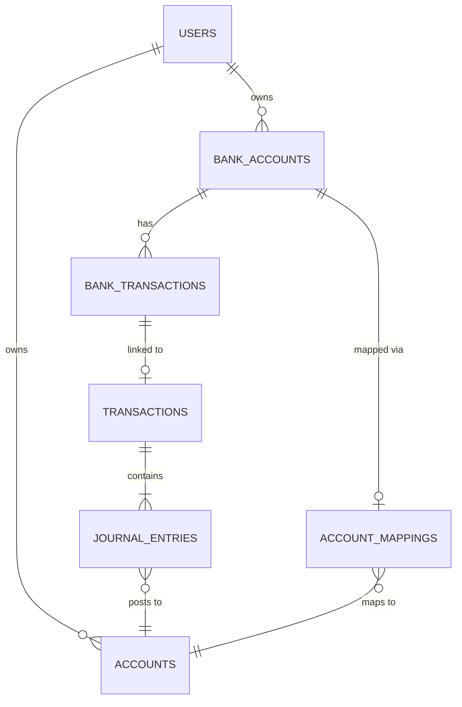

# Database

SWEN uses **PostgreSQL 18** with two logical databases in a single Postgres instance.

## Two Databases

| Database | Owner | Contents |
|---|---|---|
| `swen` | Backend service | Accounts, transactions, users, bank data |
| `swen_ml` | ML service | Examples, embeddings, enrichment cache |

Both are created by `services/database/init-db.sql` which runs automatically on first Postgres container startup:

```sql
-- init-db.sql
CREATE DATABASE swen;
CREATE DATABASE swen_ml;
```

The two services connect to their respective databases and **never cross-query** each other.

## Schema Initialisation

SWEN does not use Alembic or any migration framework. Schema is created by the **`db-init` CLI command**, which calls SQLAlchemy's `Base.metadata.create_all()`:

```bash
# Docker
docker compose run --rm backend db-init

# Bare metal
make db-init
```

This is **idempotent** — running it twice does not drop existing data. It only creates tables that don't yet exist.

!!! warning "Known limitation: no migrations"
    Schema changes between versions are applied manually. When upgrading SWEN, check the release notes for any required schema changes. Full Alembic migration support is planned for a future release.

## Main Database (`swen`)

### Key Tables

| Table | Description |
|---|---|
| `accounts` | Chart of accounts (Asset, Liability, Equity, Income, Expense) |
| `transactions` | Double-entry transactions (Draft / Posted) |
| `journal_entries` | Individual debit/credit lines belonging to a Transaction |
| `bank_accounts` | IBAN-linked bank accounts |
| `bank_transactions` | Raw statement lines from FinTS |
| `account_mappings` | BankAccount → Account linkage |
| `users` | User records (ID, email, is_admin) |
| `user_credentials` | Hashed passwords (separate table from users) |
| `fints_credentials` | Encrypted FinTS login credentials (Fernet) |
| `fints_config` | Product ID + institute CSV config (per tenant/admin) |

### Multi-tenancy

Every table that contains user data has a `user_id` foreign key. All repository queries include `WHERE user_id = :ctx_user_id` automatically via the `UserContext` pattern.

### Relationships (simplified)



## ML Database (`swen_ml`)

| Table | Description |
|---|---|
| `user_examples` | Stored transaction texts with known counter-account + embedding vector |
| `anchor_embeddings` | Per-account anchor embeddings (account name/description encoded as vectors for cold-start classification) |
| `user_noise_models` | Per-user IDF noise model (tracks boilerplate token frequencies) |
| `enrichment_cache` | SearXNG result cache (keyed by query hash, with expiry TTL) |

## Backups

The `postgres-data` Docker volume contains all your financial data. Back it up regularly:

```bash
docker compose exec postgres pg_dump -U postgres swen > backup_swen_$(date +%Y%m%d).sql
docker compose exec postgres pg_dump -U postgres swen_ml > backup_swen_ml_$(date +%Y%m%d).sql
```

Or use `pg_dumpall` to dump both databases in one command.

## Resetting the Database

!!! danger "Destructive operation"
    This deletes all data.

```bash
# Docker
docker compose run --rm backend db-reset

# Bare metal
make db-reset
```
