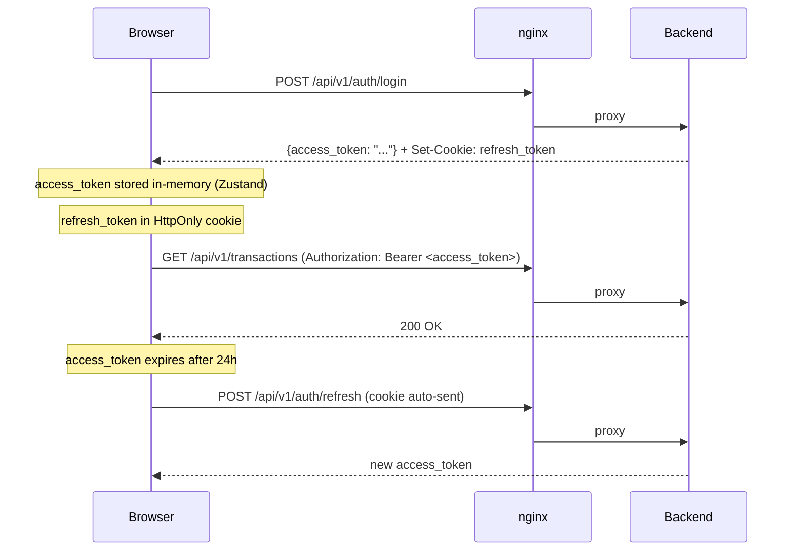

# Frontend

The frontend is a **React 19 + TypeScript** single-page application, bundled by Vite and served by nginx in production.

!!! note "AI-generated code"
    The frontend was largely written with AI assistance. It works well in practice, but hasn't been through a full human code review. Contributions are welcome!

## Tech Stack

| Tool | Version | Role |
|---|---|---|
| React | 19 | UI rendering |
| TypeScript | 5.9 | Type safety |
| Vite | 7 | Dev server + production bundler |
| TanStack Router | latest | File-based routing, type-safe URLs |
| TanStack Query | latest | Server state, caching, invalidation |
| Zustand | latest | Client state (auth store) |
| Radix UI | latest | Accessible UI primitives |
| Tailwind CSS | 4 | Utility-first styling |

## Project Layout

```
services/frontend/src/
├── routes/         ← TanStack Router file-based routes
│   ├── __root.tsx  ← root layout (nav, auth guard)
│   ├── index.tsx   ← dashboard
│   ├── transactions/
│   ├── accounts/
│   ├── bank-accounts/
│   └── settings/
├── components/     ← reusable UI components
├── hooks/          ← custom React hooks (useTransactions, useBankAccounts, …)
├── services/       ← API client, token service
├── stores/         ← Zustand stores
└── types/          ← TypeScript type definitions
```

## Routing

TanStack Router uses **file-based routing** — the folder structure under `routes/` maps directly to URL paths. The route tree is auto-generated at build time (`routeTree.gen.ts`).

All routes are protected by an auth guard in `__root.tsx` that checks for a valid access token and redirects to `/login` if missing.

## Data Fetching

TanStack Query manages all server state:

```typescript
// Fetch transactions for the current page
const { data, isLoading } = useQuery({
  queryKey: ["transactions", filters],
  queryFn: () => api.transactions.list(filters),
})
```

On mutation (post, create, delete), the relevant query keys are **invalidated**, triggering an automatic refetch.

## Auth Flow



The `TokenService` in `src/services/token.ts` manages the in-memory access token. On page reload, the access token is lost but the refresh token cookie persists, so a silent refresh is attempted on startup.

## API Client

All backend calls go through a typed API client generated from the OpenAPI schema. The client handles:

- Adding the `Authorization: Bearer` header automatically
- Calling `/auth/refresh` on 401 responses (transparent silent refresh)
- Throwing typed errors on non-2xx responses

## Build Output

`npm run build` produces a static bundle in `services/frontend/dist/`. In production this is served by nginx which also proxies `/api/*` and `/health` to the backend.
