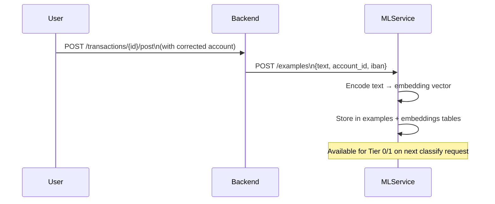

# ML Service

The ML service is a separate **FastAPI** microservice (`swen-ml`), communicating with the backend over HTTP.

## Package Layout

```
services/ml/swen_ml/
├── api/            ← FastAPI app, routers (/classify, /examples, /health)
├── config/         ← pydantic-settings for ML-specific config
├── data_models/    ← Pydantic request/response models
├── inference/
│   ├── orchestrator.py     ← ClassificationOrchestrator (4-tier pipeline)
│   ├── anchor.py           ← Tier 0: IBAN exact match
│   ├── similarity.py       ← Tier 1: embedding cosine similarity
│   ├── patterns.py         ← Tier 2: keyword/regex patterns
│   └── enrichment/         ← SearXNG web enrichment client
├── storage/        ← SQLAlchemy models + async repos (swen_ml DB)
├── training/       ← Example ingestion, embedding computation, storage
└── evaluation/     ← Offline evaluation tooling (__main__.py)
```

## Lifespan

On startup, the ML service performs the following steps in order (FastAPI `lifespan`):

1. **DB init** — Create `swen_ml` schema if it doesn't exist
2. **Encoder load** — Load `gbert-large-paraphrase-cosine` from HuggingFace (or local cache)
3. **Warm-up** — Run one dummy inference to compile CUDA/CPU kernels
4. **Enrichment init** — Verify SearXNG connectivity (non-fatal if unreachable)
5. **SharedInfrastructure** — Assemble the shared object and attach to `app.state`

Until step 3 completes, the `/health` endpoint returns `{"status": "loading"}`. The backend waits for a healthy ML service before sending classification requests.

## SharedInfrastructure

All request handlers receive a `SharedInfrastructure` object via FastAPI `Depends`:

```python
@dataclass
class SharedInfrastructure:
    encoder: SentenceTransformer
    example_repo: ExampleRepository
    enrichment_client: EnrichmentClient | None
    config: MLConfig
```

This avoids re-loading the model on every request and centralises resource management.

## Storage

The ML service uses its own **SQLite / PostgreSQL** database (`swen_ml`), separate from the main `swen` database. This separation means:

- The ML service can be scaled or replaced independently
- ML training data (examples, embeddings) does not pollute the main DB
- The main backend never reads ML storage directly

Tables:
- `examples` — stored transaction texts + their known counter-account
- `embeddings` — pre-computed embedding vectors (stored as binary blobs)
- `anchor_ibans` — IBAN → account_id mapping for Tier 0
- `keyword_patterns` — user-defined regex patterns for Tier 2
- `enrichment_cache` — SearXNG lookup results (keyed by counterparty name)

## Training Data Flow



The backend sends a training example whenever a transaction is posted **with a correction** (or on first post if no suggestion was made). No retraining loop — the example is immediately available for k-NN retrieval.

## Evaluation Tooling

`swen_ml/evaluation/__main__.py` provides an offline evaluation script:

```bash
uv run --package swen-ml python -m swen_ml.evaluation \
    --test-set data/eval.jsonl \
    --output eval_results.json
```

This runs the full classification pipeline against a labelled test set and reports accuracy per tier, per account, and an overall precision/recall breakdown.
