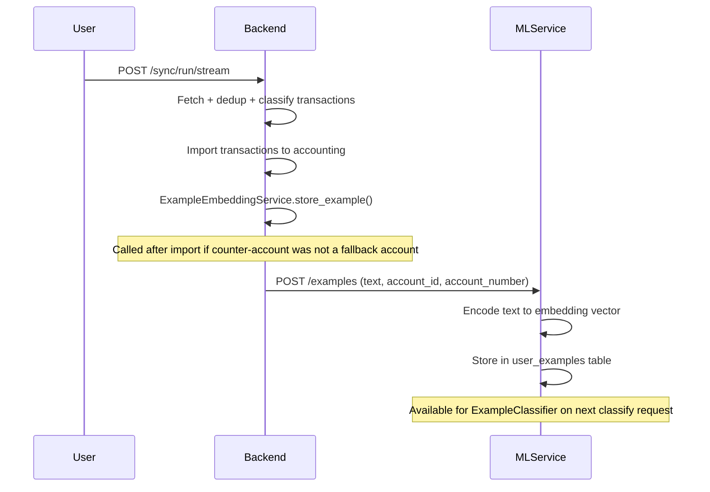

# ML Service

The ML service is a separate **FastAPI** microservice (`swen-ml`), communicating with the backend over HTTP.

## Package Layout

```
services/ml/swen_ml/
├── api/                        ← FastAPI app with routers
├── config/                     ← pydantic-settings for ML-specific config
├── data_models/                ← domain models (Anchor, Example, Noise, Enrichment)
├── inference/
│   ├── shared.py               ← SharedInfrastructure dataclass
│   ├── _models/                ← Encoder protocol + backends
│   │   ├── encoder/
│   │   │   ├── protocol.py     ← Encoder protocol
│   │   │   ├── factory.py      ← create_encoder()
│   │   │   ├── sentence_transformer.py
│   │   │   └── huggingface.py
│   │   └── nli.py              ← NLIClassifier (evaluation only)
│   ├── classification/
│   │   ├── orchestrator.py     ← ClassificationOrchestrator
│   │   ├── tiers.py            ← PreprocessingTier, ExampleTier, EnrichmentTier, AnchorTier
│   │   ├── context.py          ← PipelineContext, TransactionContext
│   │   ├── result.py           ← ClassificationResult
│   │   ├── classifiers/
│   │   │   ├── base.py         ← PipelineTier protocol
│   │   │   ├── anchor.py       ← AnchorClassifier (account embedding similarity)
│   │   │   └── example.py      ← ExampleClassifier (user history k-NN)
│   │   ├── enrichment/
│   │   │   ├── service.py      ← EnrichmentService (keyword + SearXNG)
│   │   │   ├── keywords/
│   │   │   │   ├── adapter.py  ← FileKeywordAdapter
│   │   │   │   ├── port.py     ← KeywordPort protocol
│   │   │   └── search/
│   │   │       ├── port.py     ← SearXNGAdapter protocol
│   │   │       └── searxng.py
│   │   └── preprocessing/
│   │       └── text_cleaner.py ← TextCleaner + NoiseModel
│   ├── merchant_extraction/    ← Merchant name extraction from transaction text
│   │   ├── extractor.py
│   │   └── patterns.py
│   └── recurring_detection/    ← Recurring transaction pattern detection
│       └── detector.py
├── storage/                    ← SQLAlchemy models + async repos (swen_ml DB)
│   ├── sqlalchemy/
│   │   ├── tables.py           ← Table definitions (AnchorTable, ExampleTable, etc.)
│   │   ├── repositories/       ← SQLAlchemy repo implementations
│   │   └── engine.py           ← DB engine setup
│   └── factory.py              ← RepositoryFactory (user-scoped)
├── training/                   ← Example ingestion, embedding computation
│   ├── example_embedding_service.py
│   └── account_embedding_service.py
```

## Lifespan

On startup, the ML service performs the following steps in order (FastAPI `lifespan`):

1. **DB init** — Create all tables via `Base.metadata.create_all` (uses `AsyncEngine`)
2. **Encoder load** — Load the configured sentence encoder via `create_encoder(settings)` from HuggingFace (or local cache); default: `paraphrase-multilingual-MiniLM-L12-v2`
3. **Warm-up** — Call `encoder.warmup()` to compile CUDA/CPU kernels
4. **Enrichment init** — Instantiate `SearXNGAdapter` and `FileKeywordAdapter` (if enrichment is enabled in settings); no connectivity check is performed
5. **SharedInfrastructure** — Assemble the shared object and attach `ClassificationOrchestrator` to `app.state`

Until the encoder is loaded, the `/health` endpoint returns `{"status": "degraded"}` with HTTP 503. The backend waits for a healthy ML service before sending classification requests.

## Shared Infrastructure

All request handlers receive a `SharedInfrastructure` object via FastAPI `Depends`:

```python
@dataclass
class SharedInfrastructure:
    encoder: Encoder          # sentence-transformers or HuggingFace
    settings: Settings        # ML service config
    keyword_adapter: KeywordPort | None = None    # keyword enrichment (always loaded when enrichment enabled)
    searxng_adapter: SearXNGAdapter | None = None # web search enrichment (optional)
```

This avoids re-loading the model on every request and centralises resource management.

## Storage

The ML service uses its own **SQLite / PostgreSQL** database (`swen_ml`), separate from the main `swen` database. This separation means:

- The ML service can be scaled or replaced independently
- ML training data (examples, embeddings) does not pollute the main DB
- The main backend never reads ML storage directly

Tables:

- `user_examples`: stored transaction texts + counter-account info + embedding vector. Fields: `id`, `user_id`, `embedding` (bytea), `account_id`, `account_number`, `account_type`, `text`, `created_at`
- `anchor_embeddings`: per-account anchor embeddings (account name/description encoded as vectors). Fields: `user_id`, `account_id`, `embedding` (bytea), `account_number`, `name`, `account_type`, `created_at`, `updated_at`. The `account_type` field is used during classification to filter candidates by transaction direction (e.g., income accounts are never proposed as counter-accounts for money-out transactions).
- `user_noise_models`: per-user IDF noise model (boilerplate token frequencies stored as JSONB). Fields: `user_id`, `token_frequencies` (JSONB), `document_count`, `updated_at`
- `enrichment_cache`: SearXNG lookup results (keyed by query hash, with TTL). Fields: `query_hash`, `query`, `enrichment_text`, `source_urls` (JSONB), `created_at`, `expires_at`, `hit_count`. Indexed on `expires_at` for cleanup.

## Training Data Flow


```mermaid
sequenceDiagram
    participant User
    participant Backend
    participant MLService

    User->>Backend: POST /sync/run/stream
    Backend->>Backend: Fetch + dedup + classify transactions
    Backend->>Backend: Import transactions to accounting
    Backend->>Backend: ExampleEmbeddingService.store_example()
    Note over Backend: Called after import if counter-account was not a fallback account
    Backend->>MLService: POST /examples (text, account_id, account_number)
    MLService->>MLService: Encode text to embedding vector
    MLService->>MLService: Store in user_examples table
    Note over MLService: Available for ExampleClassifier on next classify request
```

The backend submits a training example via `ExampleEmbeddingService.store_example()` (constructed via `from_factory(encoder, repository_factory)`) whenever a transaction is imported with a **non-fallback** counter-account. This happens at import time, not at post time. Fallback accounts (Sonstiges, Sonstige Einnahmen) are intentionally skipped — the ML model should not learn to use them.

## Evaluation Tooling

`swen_ml/evaluation/__main__.py` provides a **typer-based CLI** with multiple subcommands:

```bash
# Full evaluation suite (cold start + cross-validation)
uv run --package swen-ml python -m swen_ml.evaluation full

# Cold start evaluation only
uv run --package swen-ml python -m swen_ml.evaluation cold-start

# k-fold cross-validation
uv run --package swen-ml python -m swen_ml.evaluation cross-validate --folds 5

# Merchant extraction analysis
uv run --package swen-ml python -m swen_ml.evaluation merchants

# Recurring pattern detection
uv run --package swen-ml python -m swen_ml.evaluation recurring

# Embedding similarity between two texts
uv run --package swen-ml python -m swen_ml.evaluation similarity "REWE" "EDEKA"

# Embed texts and show pairwise similarities
uv run --package swen-ml python -m swen_ml.evaluation embed "REWE" "EDEKA" "Amazon"

# k-nearest neighbor analysis
uv run --package swen-ml python -m swen_ml.evaluation neighbors -k 3

# Anchor embedding evaluation
uv run --package swen-ml python -m swen_ml.evaluation anchor-eval -k 5
```

Evaluation data is loaded from `services/ml/data/examples/evaluation/` (transactions.csv, accounts.csv, eval.jsonl). The `runner.py` module provides the core evaluation logic (`load_evaluation_data`, `run_cold_start`, `run_with_examples`, `aggregate_cv_results`), while `metrics.py` provides metric computations (`tier_accuracy`, `category_accuracy`). This is only meant for development purposes because counter account classification is a highly personal thing and thus, very hard to evaluate at scale. I generated some examples with AI.

## Additional Modules

### Merchant Extraction

TBD

### Recurring Detection

TBD
