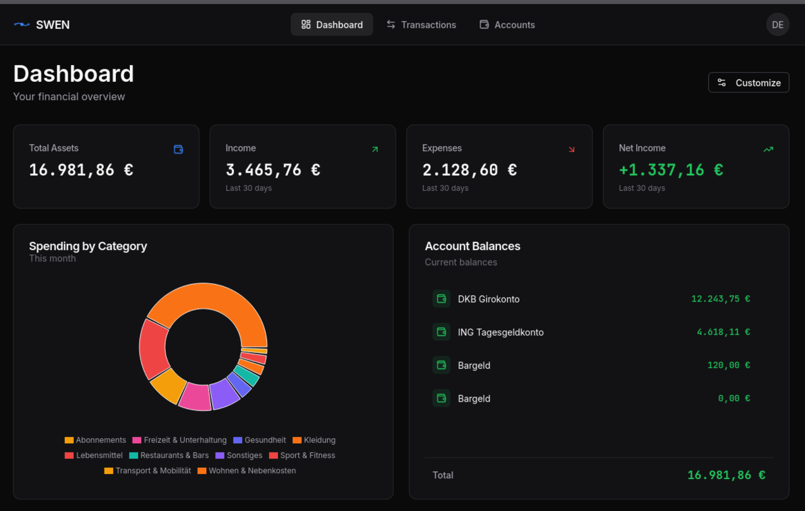
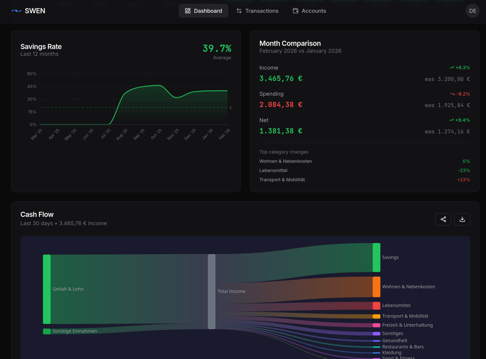
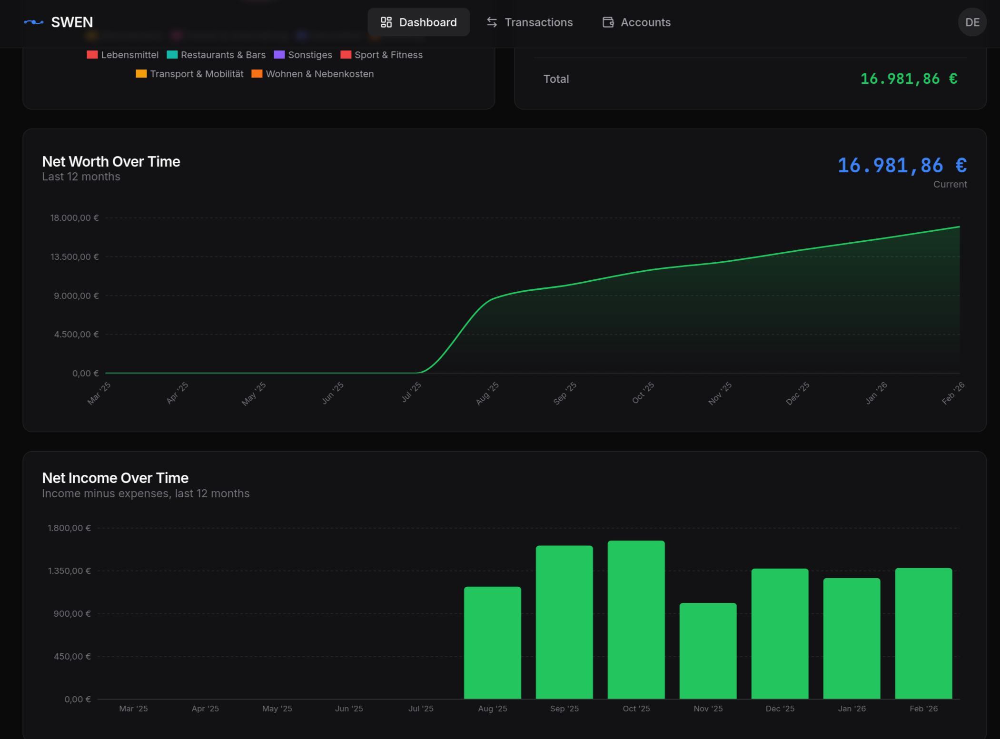
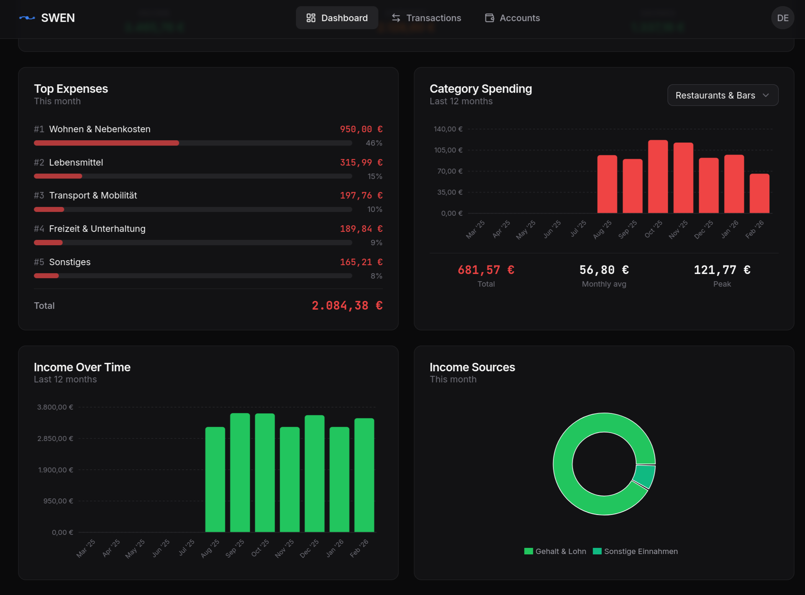
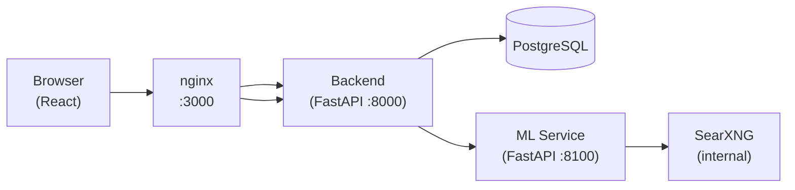

# SWEN

**Self-hosted personal accounting with German FinTS bank sync and AI-powered classification.**

SWEN is a privacy-first personal finance application you run on your own hardware. No cloud, no telemetry, no third party ever sees your bank data.

<div class="swen-gallery" role="region" aria-label="Screenshots">
  <div class="swen-gallery__track">
    <div class="swen-gallery__slide" data-caption="Dashboard overview">
      
    </div>
    <div class="swen-gallery__slide" data-caption="Dashboard overview">
      
    </div>
    <div class="swen-gallery__slide" data-caption="Dashboard overview">
      
    </div>
    <div class="swen-gallery__slide" data-caption="Dashboard overview">
      
    </div>
  </div>
  <button class="swen-gallery__btn swen-gallery__btn--prev" aria-label="Previous screenshot">&#8249;</button>
  <button class="swen-gallery__btn swen-gallery__btn--next" aria-label="Next screenshot">&#8250;</button>
  <div class="swen-gallery__dots">
    <button class="swen-gallery__dot" aria-label="Slide 1"></button>
    <button class="swen-gallery__dot" aria-label="Slide 2"></button>
    <button class="swen-gallery__dot" aria-label="Slide 3"></button>
    <button class="swen-gallery__dot" aria-label="Slide 4"></button>
  </div>
</div>
<p class="swen-gallery__caption"></p>

---

## Features

<div class="grid cards" markdown>

-   :bank: **FinTS / HBCI Bank Sync**

    Connect directly to your German bank via the standardised FinTS protocol. Transactions are imported automatically with robust duplicate detection.

-   :ledger: **Double-Entry Bookkeeping**

    Every transaction is recorded as a proper journal entry. Full audit trail, no "lost" money. Define your own chart of accounts or start from a template.

-   :robot: **AI Classification**

    A four-tier ML pipeline (IBAN anchor → embedding similarity → keyword patterns → fallback) automatically assigns counter-accounts. Learns from your corrections.

-   :house: **Fully Self-Hosted**

    Ships as a single `docker compose up` command. All data stays on your machine — no SaaS subscription, no data sharing.

</div>

---

## Get Started in 5 Minutes

=== "Docker (recommended)"

    Save the following as `docker-compose.yml`:

    ```yaml
    services:
      postgres:
        image: postgres:18-alpine
        container_name: swen-postgres
        restart: unless-stopped
        env_file:
          - ./config/.env
        volumes:
          - postgres-data:/var/lib/postgresql/data
        healthcheck:
          test: ["CMD-SHELL", "pg_isready -U postgres"]
          interval: 10s
          timeout: 5s
          retries: 5
          start_period: 10s
        networks:
          - swenetwork

      backend:
        image: maltewin/swen-backend:latest
        container_name: swen-backend
        restart: unless-stopped
        volumes:
          - ./config/.env:/app/config/.env:ro
        depends_on:
          postgres:
            condition: service_healthy
          ml:
            condition: service_healthy
        healthcheck:
          test: ["CMD", "curl", "--fail", "--silent", "http://localhost:8000/health"]
          interval: 30s
          timeout: 10s
          retries: 3
          start_period: 10s
        networks:
          - swenetwork

      ml:
        image: maltewin/swen-ml:latest
        container_name: swen-ml
        restart: unless-stopped
        volumes:
          - ./config/.env:/app/config/.env:ro
          - ml-model-cache:/app/data/cache
        depends_on:
          postgres:
            condition: service_healthy
        healthcheck:
          test: ["CMD", "curl", "--fail", "--silent", "http://localhost:8100/health"]
          interval: 30s
          timeout: 10s
          retries: 3
          start_period: 300s  # covers first-run model download (~1.5 GB)
        networks:
          - swenetwork

      frontend:
        image: maltewin/swen-frontend:latest
        container_name: swen-frontend
        restart: unless-stopped
        ports:
          - "3000:3000"
        depends_on:
          backend:
            condition: service_healthy
        networks:
          - swenetwork

      searxng:
        image: searxng/searxng:latest
        container_name: swen-searxng
        restart: unless-stopped
        networks:
          - swenetwork
        healthcheck:
          test: ["CMD", "wget", "--no-verbose", "--tries=1", "--spider", "http://localhost:8080/healthz"]
          interval: 30s
          timeout: 10s
          retries: 3
          start_period: 10s

    networks:
      swenetwork:
        driver: bridge

    volumes:
      postgres-data:
        driver: local
      ml-model-cache:
        driver: local
    ```

    Then pull or build the images, run the interactive setup wizard to generate `config/.env`, and start:

    ```bash
    docker compose pull          # or: docker compose build
    mkdir -p config
    docker run --rm -it \
      -v ./config:/app/config \
      maltewin/swen-backend:latest \
      swen setup
    docker compose up -d
    ```

    The wizard will ask for the environment (choose **Production**), registration mode, optional SMTP, then write `config/.env` automatically. Webapp can be reached on `http://localhost:3000` or use a reverse proxy (recommended!). First registered user becomes admin.

    [:material-arrow-right: Full Docker guide](deployment/docker.md)

=== "Bare Metal (dev only)"

    ```bash
    git clone https://github.com/maltewinckler/swen.git
    cd swen
    make install
    swen setup     # choose Development, generates config/.env.dev
    make ml        # terminal 1
    make backend   # terminal 2
    make frontend  # terminal 3
    ```

    [:material-arrow-right: Bare-metal guide](deployment/bare-metal.md)

---

## Core Principles

!!! info "Philosophy"
    - **Self-hosted first** — runs on a Raspberry Pi or a VPS, no cloud dependency
    - **No telemetry** — zero data sent anywhere except your own bank
    - **Double-entry discipline** — every euro in equals every euro out, auditable forever
    - **Privacy by design** — FinTS credentials are encrypted at rest, never logged

---

## Architecture at a Glance



All services run in the same Docker network — only port 3000 is exposed to the host.

---

## Status

SWEN is at **v0.1**. It is a personal project, actively used and maintained. Key known limitations:

- Only the decoupled app TAN method is fully tested across all banks
- No Alembic migrations — schema is created fresh (existing data safe across updates)
- Frontend is largely AI-generated (React/TypeScript), pending thorough review

See the [GitHub Issues](https://github.com/maltewinckler/swen/issues) for the current backlog.
