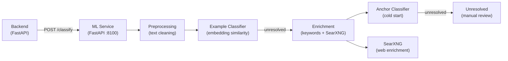

# Machine Learning

SWEN includes a self-contained ML service that **automatically classifies transactions** by predicting which counter-account should be assigned. For example, a transaction to REWE will be assigned to something like 'Groceries'. This task is intricate because the user has total freedom **how to define the categories**.

<!-- SCREENSHOT: classification-result.png — A transaction with AI-suggested counter-account and confidence badge -->

## What the ML Service Does

When a `BankTransaction` is imported, SWEN calls the ML service to predict the most likely **counter-account** (e.g. "Groceries", "Salary", "Rent"). The prediction appears as a suggestion on the Draft transaction. You either accept it (post) or correct it.

**Corrections are learning signals** — every time you change a suggested account and post the transaction, that example is stored and improves future predictions.

## Cold Start vs Learning Phase

| Phase | Behaviour |
|---|---|
| **Cold start** (no examples yet) | Uses the Anchor Classifier — embedding similarity between transaction text and account name embeddings. Web enrichment augments sparse descriptions |
| **Early use** (few examples) | Example Classifier may be unreliable with few examples; Anchor Classifier compensates |
| **Steady state** (50+ examples per account) | Example Classifier dominates; most transactions resolved before reaching the Anchor Classifier |

## Confidence Thresholds

Each prediction comes with a **confidence score** (0–1):

| Score | Displayed as | Action required |
|---|---|---|
| ≥ 0.85 | High confidence | Auto-suggested; one click to post |
| 0.70–0.84 | Medium confidence | Suggested with caution indicator |
| 0.35–0.69 | Low confidence | Anchor Classifier result — shown with low-confidence indicator |
| < 0.35 | Unresolved | No suggestion aka “Needs review” |

Thresholds are configurable via environment variables (see [ML Service internals](../dev/ml-service.md)).

## What the ML Service Is Not

- **Not a cloud service** — runs entirely locally, no data leaves your machine
- **Not a large language model** — it uses a domain-specific German sentence-transformer, not GPT
- **Not infallible** — it makes mistakes, especially early on; your corrections are the feedback loop
- **Not required** — SWEN works without the ML service; you just classify manually

## Architecture Overview

The ML service is a separate **FastAPI** microservice that the backend calls over HTTP. It maintains its own SQLite database of training examples and a loaded sentence-transformer model.

For a deep dive into the pipeline see [Classification Pipeline](pipeline.md).

## Section Contents

-   **[Classification Pipeline](pipeline.md)**

    The four-tier architecture in depth — when each tier fires, confidence scores, and the feedback loop.

-   **[Embeddings](embeddings.md)**

    The German sentence-transformer model, HuggingFace cache setup, and pooling strategies.

-   **[Web Enrichment](enrichment.md)**

    How SearXNG is used to look up merchant names and enrich sparse transaction descriptions.

