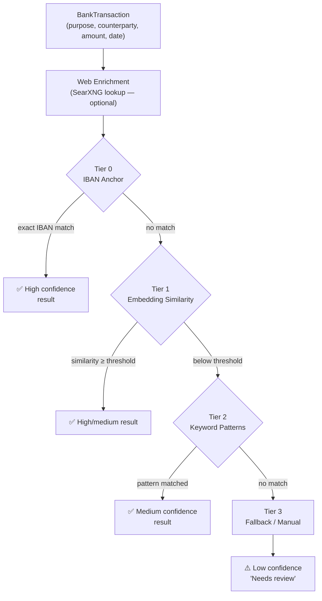
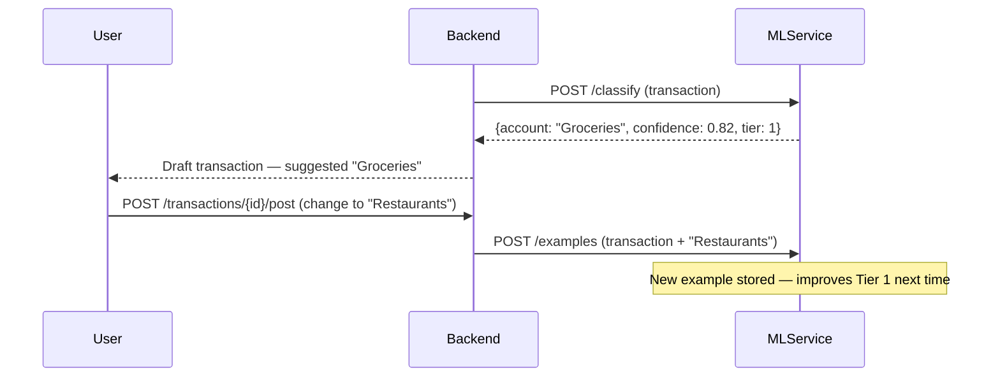

# Classification Pipeline

SWEN's ML service uses a **four-tier pipeline** to classify transactions. Each tier is attempted in order; if a tier cannot produce a confident result, the next tier is tried.

## Pipeline Overview



## Tier 0 — IBAN Anchor

**Fires when:** The transaction has a counterparty IBAN that exactly matches a known IBAN in the example store.

This is the most reliable tier. If you have ever received your salary from IBAN `DE12…` and classified it as "Salary", all future transactions from that IBAN are automatically classified as "Salary" with maximum confidence.

**Confidence:** Always ≥ 0.95

**Example:** `DE56 200 400 600 1234 5678` → previously classified as `Income / Salary` → new transaction from same IBAN → Tier 0 matches → confidence 0.97

## Tier 1 — Embedding Similarity

**Fires when:** Tier 0 finds no IBAN match, but there are stored example transactions.

The transaction's text (purpose + counterparty name, optionally enriched via SearXNG) is encoded as a **vector embedding** using a sentence-transformer model. The embedding is compared against all stored example embeddings using **cosine similarity**.

The top-k nearest neighbours vote on the counter-account. If the top neighbour's similarity exceeds the configured threshold (default `0.75`), that account is returned.

**Confidence:** Proportional to cosine similarity

**Example:**
```
New:      "REWE MARKT 4821 HAMBURG" → embedding [0.12, 0.83, ...]
Stored:   "REWE SAGT DANKE 123"     → embedding [0.11, 0.84, ...]
                                        similarity = 0.93 → "Groceries"
```

**Cold start behaviour:** If fewer than 3 examples exist for any account, Tier 1 skips to avoid unreliable k-NN with too little data.

## Tier 2 — Keyword Patterns

**Fires when:** Tiers 0 and 1 produce no confident result.

A set of configurable regex / keyword patterns is matched against the transaction purpose. Patterns are defined per-user and cover common German merchants and transaction types.

**Confidence:** Fixed per pattern (typically 0.70)

**Examples:**
```
"PAYPAL"            → "Online Shopping / Payments"
"EDEKA|REWE|ALDI"  → "Groceries"
"NETFLIX"           → "Subscriptions"
"GEHALT|LOHN"      → "Income / Salary"
```

See the admin UI under **Settings → ML → Keyword Patterns** to add or edit patterns.

## Tier 3 — Fallback

**Fires when:** No other tier produces a match.

Returns a low-confidence result with no account suggestion, marking the transaction as "Needs review". The user must manually assign the counter-account.

**Confidence:** 0.0 — not shown as a prediction, shown as "Unclassified"

## The Feedback Loop

Every transaction you **post with a correction** (i.e. you changed the suggested account) is automatically added to the example store. This example is then used by Tier 1 on future similar transactions.



## ClassificationOrchestrator

The `ClassificationOrchestrator` class in `swen_ml/inference/` coordinates the pipeline. It:

1. Calls the enrichment service (optional, async with timeout)
2. Runs Tier 0 (sync, O(1) IBAN lookup)
3. Runs Tier 1 (vector similarity search against example store)
4. Runs Tier 2 (regex pattern matching)
5. Returns the first result that exceeds the confidence threshold

Each tier returns a `ClassificationResult` with `account_id`, `confidence`, and `tier` (for transparency).
