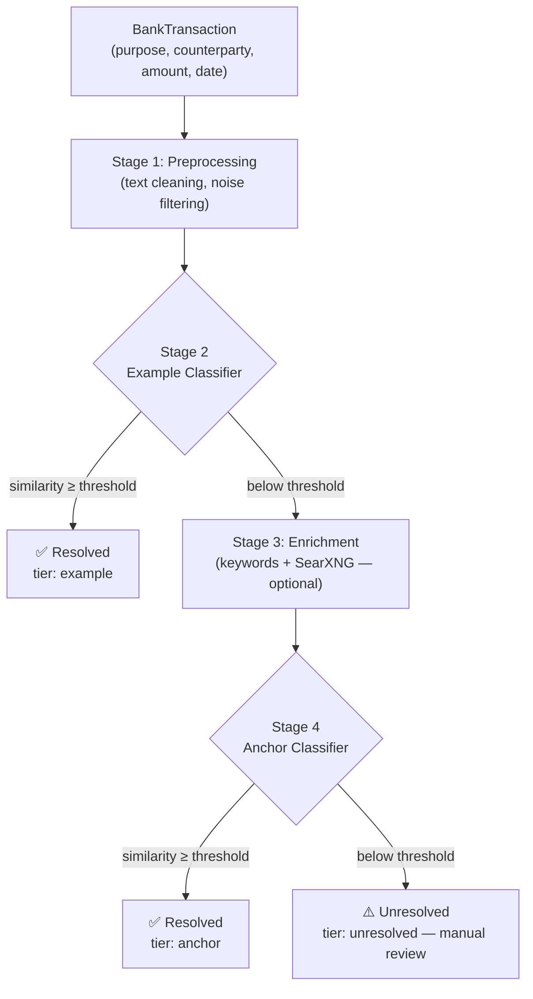
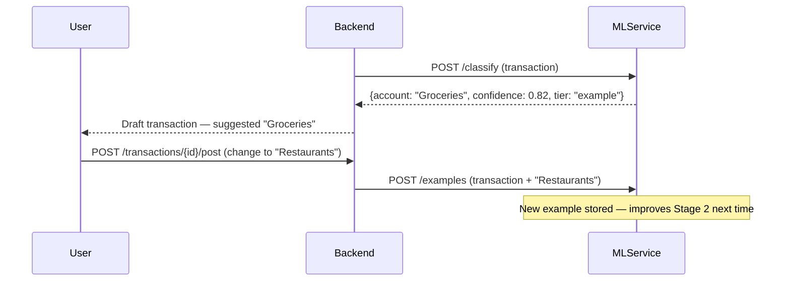

# Classification Pipeline

SWEN's ML service uses a **four-stage pipeline** to classify transactions. Each stage runs in order; the pipeline exits early once all transactions in a batch are resolved.

## Pipeline Overview



## Stage 1 — Preprocessing

**Always runs** on every transaction before any classifier.

The `TextCleaner` performs:

- **Payment provider stripping** — removes payment intermediary prefixes (`PAYPAL`, `SUMUP`, `ZETTLE`, `STRIPE`, `KLARNA`) from the counterparty name to expose the underlying merchant
- **Separator normalisation** — converts `.`, `/`, `*` to spaces
- **Noise filtering** — an IDF-based noise model learns which tokens are boilerplate for a user's bank (e.g. `KARTE`, `UHR`, reference numbers). High-frequency boilerplate tokens are stripped before embeddings are built.

Preprocessing writes `cleaned_counterparty` and `cleaned_purpose` into the transaction context for all downstream stages.

## Stage 2 — Example Classifier

**Fires when:** The user's example store is non-empty.

The transaction's cleaned text (`cleaned_counterparty` + `cleaned_purpose`) is encoded as a vector and compared against all stored **example transaction embeddings** using cosine similarity.

**Decision logic:**

| Condition | Outcome |
|---|---|
| Top similarity ≥ **0.85** (high confidence) | Accepted |
| Top similarity ≥ **0.70** *and* margin vs 2nd-best ≥ **0.10** | Accepted |
| Otherwise | Not resolved — passes to Stage 3 |

**Cold start behaviour:** If the example store is empty, this stage is skipped entirely.

!!! note "No enrichment here"
    The Example Classifier uses un-enriched text only. Enrichment is reserved for Stage 4 where it has the most impact on cold-start accuracy.

**Example:**
```
New:      "REWE MARKT 4821 HAMBURG" → embedding [0.12, 0.83, ...]
Stored:   "REWE SAGT DANKE 123"     → embedding [0.11, 0.84, ...]
                                        similarity = 0.93 → "Groceries"
```

## Stage 3 — Enrichment

**Runs on:** Transactions not resolved by Stage 2.

The enrichment stage appends extra context to sparse transaction descriptions before the Anchor Classifier runs. Two methods are tried in order:

1. **Keyword enrichment** — each token in the transaction text is matched against a built-in German keyword map (`keywords_de.txt`). A match appends a descriptive phrase (e.g. `rewe` → `"REWE Lebensmittel Supermarkt"`). Fast O(m) lookup with no network call required.
2. **Search enrichment** — if no keyword match and SearXNG is configured and reachable, a web search is performed for the counterparty name. The top result's title and first sentence are appended.

The enriched text is stored in the transaction context and used only by Stage 4.

See [Web Enrichment](enrichment.md) for configuration details.

## Stage 4 — Anchor Classifier

**Fires on:** Transactions still unresolved after Stage 3.

Each account has a pre-computed **anchor embedding** — a vector of the account's name and description. The transaction's enriched text (counterparty + purpose + enrichment) is encoded and compared against all anchor embeddings using cosine similarity.

If the best similarity exceeds the configured threshold (default **0.35**), that account is returned.

**Cold start:** This is what enables classification with zero user history. Anchor embeddings are computed from account names when accounts are created, so the pipeline produces suggestions from day one.

**Confidence:** Proportional to cosine similarity (typically 0.35–0.65 for anchor matches)

## Unresolved

If no stage produces a match above threshold, the pipeline returns `tier: "unresolved"` with `confidence: 0.0`. The transaction is marked **Needs review** — no account is suggested and the user assigns it manually. Every manual assignment becomes a new example for Stage 2.

## The Feedback Loop

Every transaction you **post with a correction** (i.e. you changed the suggested account) is automatically added to the example store and improves Stage 2 on future similar transactions.



## ClassificationOrchestrator

The `ClassificationOrchestrator` class in `swen_ml/inference/classification/orchestrator.py` coordinates the full pipeline. It:

1. Loads user-specific data from the database (examples, anchors, noise model)
2. Observes incoming transaction texts to update the IDF noise model
3. Builds and executes the four pipeline stages in sequence
4. Exits early if all transactions are resolved before all stages complete

The API response uses a `tier` field (`"example"` | `"anchor"` | `"unresolved"`) to indicate which stage resolved each transaction.
